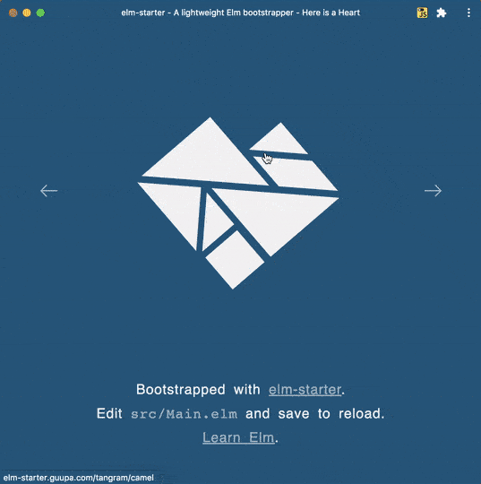

# elm-starter

`elm-starter` is an experimental Elm bootstrapper that can also be plugged into already existing Elm applications. 

### Demos

These are two simple examples of websites built with `elm-starter`:

* https://elm-starter.guupa.com/
* https://elm-todomvc.guupa.com/



## Characteristics

* Generate a PWA (Progressive Web Application)
* Most of the logic is written in Elm, including all the necessary files that are automatically generated:
    * `index.html` (generated from [`Index.elm`](https://github.com/lucamug/elm-start-private/blob/master/src/Index.elm) using [`zwilias/elm-html-string`](https://package.elm-lang.org/packages/zwilias/elm-html-string/latest/))
    * [`sitemap.txt`](https://elm-starter.guupa.com/sitemap.txt)
    * [`manifest.json`](https://elm-starter.guupa.com/manifest.json)
    * [`service-worker.js`](https://elm-starter.guupa.com/service-worker.js)
    * [`robots.txt`](https://elm-starter.guupa.com/robots.txt)
* Pages are pre-rendered during the build together with their snapshots, using [`puppeteer`](https://github.com/puppeteer/puppeteer)
* The app can work without Javascript(\*)
* SEO
* Preview cards (Facebook, Twitter, etc.) work as expected
* Works offline
* Installable both on desktop and on mobile
* High score with Lighthouse
* Friendly notifications: "Loading...", "Must enable Javascript...", "Better enable Javascript..."
* Potentially compatible with all Elm libraries (elm-ui, elm-spa, etc.)
* Hopefully relatively simple to use and maintain
* Works with Netlify, Surge, etc.


# How to bootstrap a new project

```
$ git clone https://github.com/lucamug/elm-starter
$ mv elm-starter my-new-project
$ cd my-new-project
$ rm -rf .git
$ npm install
```

## Available Scripts

In the project directory, you can run:

### `$ npm start`

Runs the app in the development mode.
Open [http://localhost:8000](http://localhost:8000) to view it in the browser.
Edit `src/Main.elm` and save to reload the browser.

### `$ npm run build`

Builds the app for production to the `elm-stuff/elm-starter-files/build` folder.

### `$ npm run serverBuild`

Launches a server in the `build` folder.
Open [http://localhost:9000](http://localhost:9000) to view it in the browser.


# How to use `elm-starter` in existing Elm application

Let's suppose your exsisting project is in `my-elm-app`

* Clone `https://github.com/lucamug/elm-starter`
* Copy
   * The folder `elm-starter/src-elm-starter/` to `my-elm-app/src-elm-starter/`
   * The file `elm-starter/src/Index.elm` to `my-elm-app/src/Index.elm`
   * The function `conf` from `elm-starter/src/Main.elm` to `my-elm-app/src/Main.elm` (remember to expose it)
* If you don't have `package.json` in your project, add one with `$ npm init`
* Add `node` dependencies with these commands 
    ```
    $ npm install --save-dev chokidar-cli
    $ npm install --save-dev concurrently
    $ npm install --save-dev elm
    $ npm install --save-dev elm-live
    $ npm install --save-dev html-minifier
    $ npm install --save-dev puppeteer
    $ npm install --save-dev terser
    ```
* Add `src-elm-starter` as extra `source-directory` in `elm.json`, the same as in `elm-starter/elm.json`
* Add these commands to `package.json` (or run them directly)
    ```
      "scripts": {
        "start":       "node ./src-elm-starter/starter.js start",
        "build":       "node ./src-elm-starter/starter.js build",
        "serverBuild": "node ./src-elm-starter/starter.js serverBuild"
      },
    ```
Done!


# Netlify

When setting up the app with Netlify, input these in the deploy configuration:

* Build command: `npm run build` (or `node ./src-elm-starter/starter.js start`)
* Publish directory: `elm-stuff/elm-starter-files/build`
    


# (\*) About the application working wihtout Javascript

Working without Javascript depends on the application. The `elm-starter` example works completely fine also wihtout Javascript, the only missing thing is the smooth transition between pages.

The `todo-mvc` example instead require Javascript. Note that in this example, compared to Evan's original TodoMVC, I slightly changed the CSS to improve the a11y (mainly lack of contrast and fonts too small).

These two example use `Browser.element` but I tested also with `Browser.application` and it seems working.

The working folder of `elm-starter` is `elm-stuff/elm-starter-files`. These files are automatically generated and should not be edited directly, unless during some debugging process.


# Advanced stuff

## Disabling pre-rendering

Is possible to disable pre-rendering just passing an empty list to `Main.conf.urls`. In this case the app will work as "Full CSR" (Full Client-side Rendering)

## How to customize your project.

The main two places where you can change stuff are:

* `src/Index.elm`
* `src/Main.elm` (`conf` function)

`elm-starter` is opinionated about many things. If you want more freedom, you can change stuff in

* `src-elm-starter/**/*.elm`

The reason `Main.conf` is inside `Main.elm` is so that it can exchange data. For example:

* `title`: `Main.conf` -> `Main`
* `urls`: `Main.conf` <- `Main`
    
Moreover `Main.conf` is used by `src-elm-starter` to generate all the static files.

## elm-console-debug.js for nice console output

Support https://github.com/kraklin/elm-debug-transformer out of the box for nice `Debug.log` messages in the console.

## Changing meta-tags

For better SEO, you should update meta-tags. To do so, there is pre-defined port `changeMeta` that you can use this way:

```
updateHtmlMeta : Route -> Cmd msg
updateHtmlMeta route =
    Cmd.batch
        [ changeMeta
            { querySelector = "title"
            , fieldName = "innerHTML"
            , content = conf.title ++ " - Here is a " ++ tangramToString (routeToTangram route)
            }
        , changeMeta
            { querySelector = "meta[property='og:image']"
            , fieldName = "content"
            , content = conf.domain ++ routeToAbsolutePath route ++ "/snapshot.jpg"
            }
        ]
```

## Configuration

You can verify the configuration in real-time using elm reactor:
```
$ node_modules/.bin/elm reactor
```
and check the page

http://localhost:8000/src-elm-starter/Application.elm

## Meta-data

The global object `ElmStarter` contain metadata about the app:
```
{ commit: "abf04f3"
, branch: "master"
, env: "dev"
, version: "0.0.5"
, versionElmStart: "0.0.12"
}
```

This data is also available in Elm through Flags.

`ElmApp` is another global object that is the handle of the Elm app.


# Limitations

* Javascript and CSS to generate the initial `index.html` are strings :-(
* `src-elm-starter/starter.js`, the core of `elm-starter`, is ~400 lines of Javascript. I wish it could be smaller


# Similar projects

These are other projects that can be used to bootstrap an Elm application or to generate a static site:

* [elm-pages](https://package.elm-lang.org/packages/dillonkearns/elm-pages/latest/)
* [elmstatic](https://github.com/alexkorban/elmstatic)
* [elm-spa](https://package.elm-lang.org/packages/ryannhg/elm-spa/latest/)
* [create-elm-app](https://github.com/halfzebra/create-elm-app)
* [spades](https://github.com/rogeriochaves/spades)

Something that `elm-starter` doesn't do 

* Doesn't generate Elm code automatically, like Routes parser
* Doens't do SSR (Server Side Render) but just pre-render during the build.=
* Doesn't change the Elm compiled Javascirpt
* Doesn't create a web site based from static files
* There is no "[hydration](https://developers.google.com/web/updates/2019/02/rendering-on-the-web)", unless Elm does some magic that I am not aware of. 

Considering the table at the bottom of [this article](https://developers.google.com/web/updates/2019/02/rendering-on-the-web), `elm-starter` can support you in these rendering approach

* Static SSR
* CSR with Prerendering
* Full CSR

It cannot help you with

* Server Rendering
* SSR with (re)hydration


 